## About Me

Welcome! I am currently an assistant professor at School of Public Administration, [Hunan University](https://www-en.hnu.edu.cn/), China. Prior to this, I was a lecturer (equivalent to assistant professor) at School of Political Science and Public Administration, [Wuhan University](https://en.whu.edu.cn/), China (2022-2025). I received my Ph.D. in Political Science from [Lingnan University, Hong Kong](https://www.ln.edu.hk/) in 2022. My work has been published or is forthcoming in journals such as *Comparative Politics*, *Policy Studies Journal*, *Political Behavior*, *Political Research Quarterly*, and *The China Quarterly*.

## Research Interests

-- Media & Politics

-- Public Opinion

-- Public Policy 

-- Governance

-- China

-- Computational Social Science

## Publications

  

    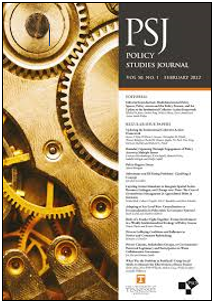
    
      AI for Persuasion? How Policy Endorsement from Large Language Models Increases Citizens’ Compliance Willingness in China, 
      Policy Studies Journal, 
      <i>forthcoming</i>. (w/ Miao Xiang)
    
  

  

    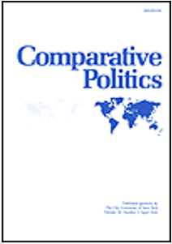
    
      <a href="https://papers.ssrn.com/sol3/papers.cfm?abstract_id=4106610">From Maoism to MAGA: Embracing Democracy with Authoritarian Imprints</a>, 
      Comparative Politics, 
      <i>forthcoming</i>. (w/ Sibo Liu, Dong Zhang)
    
  

  

    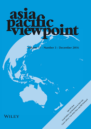
    
      <a href="https://onlinelibrary.wiley.com/doi/abs/10.1111/apv.12449">Displaced Discrimination? Media Coverage of China and Public Attitudes Toward Chinese Immigrants in the United States</a>, 
      Asia Pacific Viewpoint, 2025, Online First. (w/ Chen Zhang, Pak Hung Lam)
    
  

  

    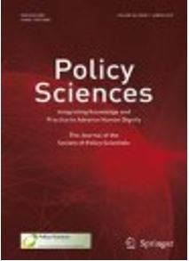
    
      <a href="https://link.springer.com/article/10.1007/s11077-025-09576-7">Digital government construction and civic policy participation: evidence from China</a>, 
      Policy Sciences, 2025, 58(2): 345–367.
    
  

  

    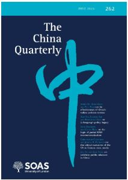
    
      <a href="https://www.cambridge.org/core/journals/china-quarterly/article/abs/fandom-culture-as-a-catalyst-for-propaganda/F652D4643CDC257658C4D8305DFB2705">Fandom culture as a catalyst for propaganda</a>, 
      The China Quarterly, 2024, 259: 814-823.
    
  

  

    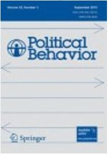
    
      <a href="https://link.springer.com/article/10.1007/s11109-023-09900-y">Birds of a feather: Sharing democratic values eases immigration in a postmaterialist society</a>, 
      Political Behavior, 2024, 46(3): 1887-1911. (w/ Jin Jiang, Dong Zhang)
    
  

  

    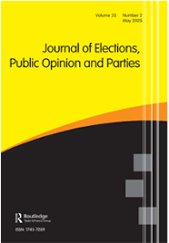
    
      <a href="https://www.tandfonline.com/doi/abs/10.1080/17457289.2024.2421562">Demystifying the dynamics of China’s overseas image with a large-scale social media dataset</a>, 
      Journal of Elections, Public Opinion and Parties, 2024, Online First.
    
  

  

    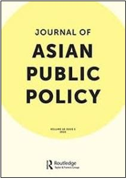
    
      <a href="https://www.tandfonline.com/doi/abs/10.1080/17516234.2024.2372136">Sorrow under prosperity: how downtown residence influences the welfare of disabled people in China</a>, 
      Journal of Asian Public Policy, 2024, Online First. (w/ Mengbing Du, Ning Qiu)
    
  

  

    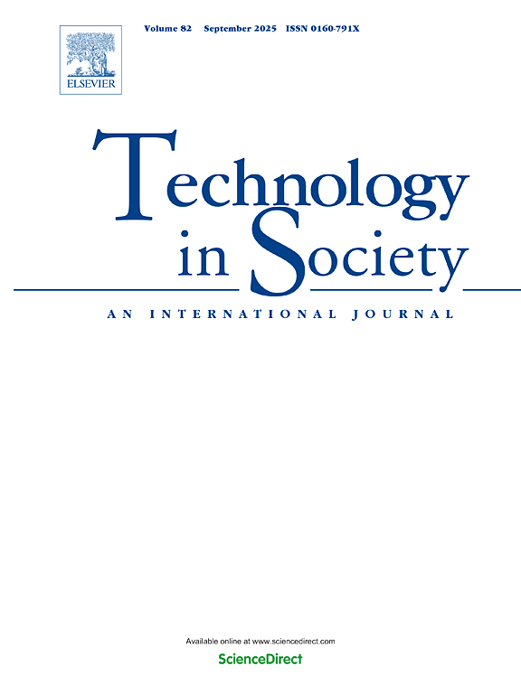
    
      <a href="https://www.sciencedirect.com/science/article/abs/pii/S0160791X24001398">Knowing more, worrying less? Internet use eases public concern about immigrant cultural threat</a>, 
      Technology in Society, 2024, 77: 102591.
    
  

  

    
    
      <a href="https://link.springer.com/article/10.1007/s11077-023-09516-3">Female members of parliament, right-wing parties, and the inclusiveness of immigration policy: evidence from 26 European countries</a>, 
      Policy Sciences, 2023, 56(4): 689-707.
    
  

  

    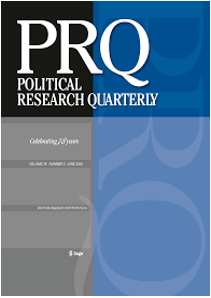
    
      <a href="https://journals.sagepub.com/doi/abs/10.1177/10659129211049389">Amusing ourselves to loyalty? Entertainment, propaganda, and regime resilience in China</a>, 
      Political Research Quarterly, 2022, 75(4): 1096-1112.
    
  

  

    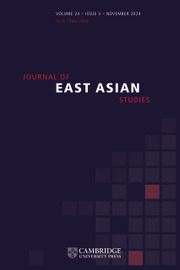
    
      <a href="https://www.cambridge.org/core/journals/journal-of-east-asian-studies/article/framing-as-an-information-control-strategy-in-times-of-crisis/7604E7F9879144E6257B5923C434A2BD">Framing as an information control strategy in times of crisis</a>, 
      Journal of East Asian Studies, 2022, 22(2): 255-279. (w/ Huang Huang, Dong Zhang)
    
  

   
## Working Papers and Projects

- Elite cues and public attitudes toward climate change *R&R*

- Open data and political trust *R&R*

- Education and trust *R&R*

- Social media and polarization *R&R*

## Teaching

-- Instructor 

- Social Science Research Methods

- Digital Governance 

-- Teaching Assistant

- Comparative Politics

- Public Policy: Values & Processes

- Media, Data and Politics

## Services

As an ad hoc reviewer for journals such as *British Journal of Political Science*, *Information, Communication & Society*, *Journal of Contemporary China*, *Poetics*, *Political Behavior*, and *Public Performance & Management Review*.
